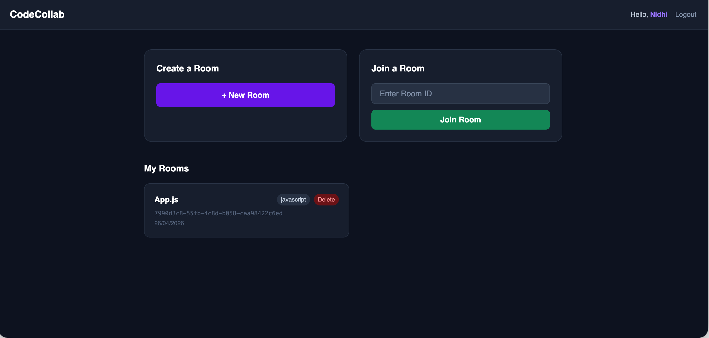

# CodeCollab

> Real-time collaborative code editor — multiple users, one editor, zero conflicts.



---

## What is this?

CodeCollab lets you write code with others in real-time. Create a room, share the Room ID, and everyone's edits merge automatically — no overwrites, no conflicts. Think Google Docs but for code.

---

## Tech Stack

**Frontend** — React 18, Vite, CodeMirror 6, Tailwind CSS  
**Real-time** — Socket.io + Yjs (CRDT)  
**Backend** — Node.js, Express, JWT auth  
**Storage** — MongoDB (persistence) + Redis (active session cache)

---

## Features

- Conflict-free simultaneous editing via **Yjs CRDT**
- Live cursor positions with color-coded user labels
- Multi-language syntax highlighting — JS, Python, Java, C++
- JWT auth with bcrypt password hashing
- Rate limiting on login/register (brute force protection)
- Redis caches active rooms; MongoDB persists code permanently
- Room create, join by ID, delete

---

## Local Setup

**Prerequisites:** Node.js 18+, MongoDB, Redis

```bash
# 1. Clone
git clone <repo-url>
cd collaborative-editor

# 2. Install
cd server && npm install
cd ../client && npm install

# 3. Env — server/.env
PORT=3001
MONGODB_URI=mongodb://localhost:27017/collaborative-editor
JWT_SECRET=your_secret_here
REDIS_URL=redis://localhost:6379
CLIENT_URL=http://localhost:5173

# 4. Env — client/.env
VITE_SOCKET_URL=http://localhost:3001

# 5. Run
brew services start redis          # Terminal 1
cd server && npm run dev           # Terminal 2
cd client && npm run dev           # Terminal 3
```

Open `http://localhost:5173`

---

## How the collaboration works

Each keystroke is a **CRDT operation** (via [Yjs](https://github.com/yjs/yjs)). The server applies and relays these operations — it never arbitrates who wins. Two users typing simultaneously both survive, regardless of network delay. This is the same approach used by Notion and Linear.

Redis holds live room state (fast reads per keystroke). MongoDB stores the final code. New users joining get state from Redis, falling back to MongoDB if Redis was cleared.

---

## Project Structure

```
server/
  config/       # MongoDB + Redis clients
  controllers/  # Auth + room logic
  middleware/   # JWT validation
  models/       # User, Room schemas
  routes/       # REST API routes
  socket/       # Yjs CRDT + Socket.io handler

client/src/
  context/      # Auth context
  pages/        # Login, Register, Home, EditorPage
  components/   # UserList
  utils/        # Axios instance with JWT interceptor
```

---

## API

| Method | Endpoint | Auth | Description |
|---|---|---|---|
| POST | `/api/auth/register` | No | Register (5/hr limit) |
| POST | `/api/auth/login` | No | Login (10/15min limit) |
| GET | `/api/auth/me` | Yes | Current user |
| POST | `/api/rooms` | Yes | Create room |
| GET | `/api/rooms/my` | Yes | My rooms |
| GET | `/api/rooms/:id` | Yes | Room details |
| DELETE | `/api/rooms/:id` | Yes | Delete room |

---

## Deployment

| Service | Use for | Free tier |
|---|---|---|
| Vercel | Client | Yes |
| Render | Server | Yes |
| MongoDB Atlas | Database | 512MB |
| Upstash | Redis | 10k req/day |

---

## What's Missing

- [ ] Code execution (Judge0 API / Docker sandbox)
- [ ] Unit + integration tests (Jest + Supertest)
- [ ] Room permissions (invite-only, read-only viewer)
- [ ] Version history / save snapshots
- [ ] Multiple files per room
